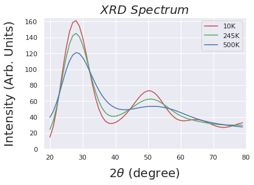
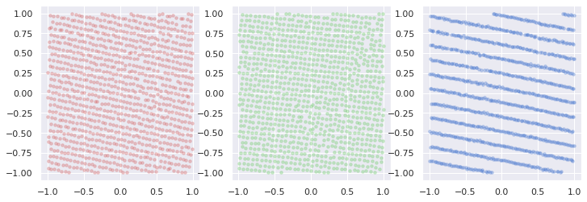
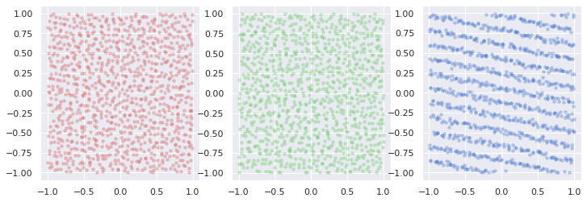
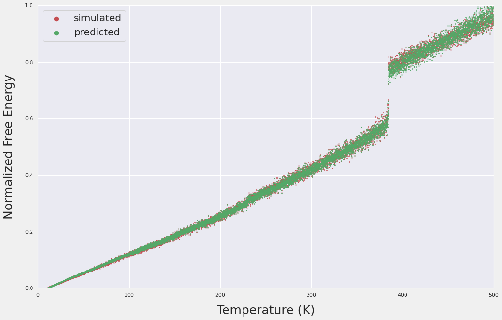
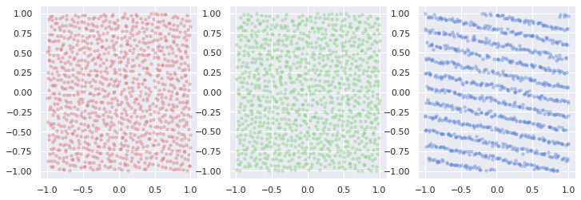
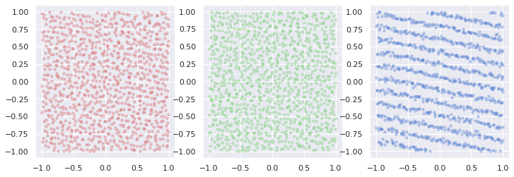
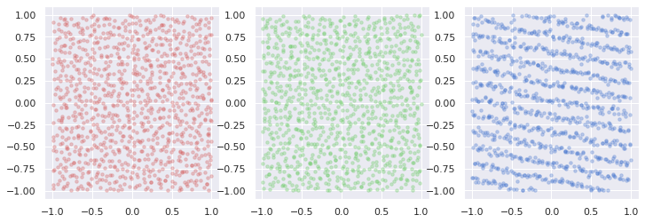

# AI-for-Science

Generate super large ( > 1000 atoms) molecular configurations (solid state) with inputs from experiments (e.g. XRD) and training using simulation data.

The ultimate task is to generate N x 3d molecular coordinates (N, x, y, z) under the constraints temperature T, experimental observables like XRD, or any techniques that relate to the atomic coordinates (N, x, y, z) such that it's energy is minimal when tested.

Simulated XRD Spectrum using Debye Scattering:

Now very accurate free energy surface prediction has been achieved, and generate reasonable molecule configurations that could possibly deceive human eyes were also presented. The last step is to generate configurations that give minimal energy (physical).

Simulated molecular configuraions:

10K

245K

500K

Free Energy

Generated Samples

200K

240K

354K

The problems possibly came from the following apsects when generating physical structures:

1. The max pooling op lost too much information.

2. The optimal transport problem WGAN relies on would require the Lipschitz continuity, convexity... for the Kantorovich's duality. These are more or less accomplished via the spectral norm or gradient penalty, maybe for the Lipschitz purpose it serves, but not necessarily the convexity. Therefore the duality may not hold all the time. And also there's information loss to maintain a stable training. The information loss may not be a problem for an image but an issue for physics.

3. The data were continuous molecular dynamic trajectories without relaxation at each step, i.e. for the same T the variance was not learned thoroughly. 
